# Segmentasi Pelanggan Peritel Online Inggris

**Dataset:** [UCI Online Retail](https://archive.ics.uci.edu/dataset/352/online+retail) &nbsp;|&nbsp; [Mirror Kaggle](https://www.kaggle.com/datasets/vijayuv/onlineretail)
&nbsp;|&nbsp; ~542 ribu transaksi, peritel hadiah online Inggris, Des 2010 - Des 2011.

---

## 1. Problem Statement

Sebuah toko hadiah online di Inggris menyimpan catatan transaksi setahun penuh,
tetapi memperlakukan **semua pelanggan dengan cara yang sama** - promo, email, dan
perhatian yang identik. Padahal pelanggan setia bernilai jutaan dan pembeli sekali
mampir jelas butuh perlakuan berbeda. Akibatnya anggaran pemasaran terbuang merata
dan pelanggan terbaik berisiko terlewat.

**Pertanyaan bisnis:** Siapa sebenarnya pelanggan toko ini bila dilihat dari pola
perilakunya, dan bagaimana tiap kelompok sebaiknya diperlakukan agar retensi dan
revenue meningkat?

**Pendekatan:** Karena tidak ada label "pelanggan baik/buruk" untuk diprediksi, ini
adalah masalah **unsupervised (clustering)**. Kita rangkai fitur perilaku dari
kerangka RFM dan pengembangannya, lalu biarkan data memunculkan segmennya sendiri.

---

## 2. Struktur Proyek

```
9-Customer-Personality-Analysis/
├── retail-sales.ipynb    # Notebook utama - analisis end-to-end, jalankan berurutan
├── online_retail.csv     # Data sumber (UCI Online Retail)
├── images/               # Grafik hasil yang dipakai di README ini
└── README.md
```

Notebook `retail-sales.ipynb` berjalan sebagai satu alur utuh dalam sembilan tahap:

| Tahap | Yang dikerjakan |
|---|---|
| 1. Rumusan masalah | Menetapkan konteks bisnis, tujuan, dan kriteria sukses |
| 2. Pembersihan data | Menyaring transaksi mentah lewat corong transparan |
| 3. EDA + uji statistik | Menjelajah data lalu **membuktikan** temuannya |
| 4. Rekayasa fitur | Membangun 8 fitur perilaku dari pengetahuan retail |
| 5. Preprocessing | Pipeline bebas kebocoran + pemeriksaan PCA |
| 6. Clustering | Mengadu K-Means, GMM, DBSCAN, HDBSCAN |
| 7. Evaluasi | Menguji kualitas & kestabilan model |
| 8. Interpretasi | Mengenali & memberi nama tiap segmen |
| 9. Preskriptif | Menerjemahkan segmen jadi rekomendasi bisnis |

Data mentah dibersihkan menjadi **391.286 transaksi** dari **4.334 pelanggan**
(sekitar 72% baris mentah dipertahankan; sisanya dibuang karena tanpa identitas
pelanggan, pembatalan, atau bukan produk).

---

## 3. Hasil & Temuan

### 3.1 Exploratory Data Analysis

Setiap temuan tidak hanya dilihat, tetapi diuji secara statistik.

**Revenue sangat terpusat di Inggris (~83%).** Pasar ekspor hanya ekor kecil.
Artinya: geografi bukan tuas segmentasi - perilaku pelangganlah yang membedakan.

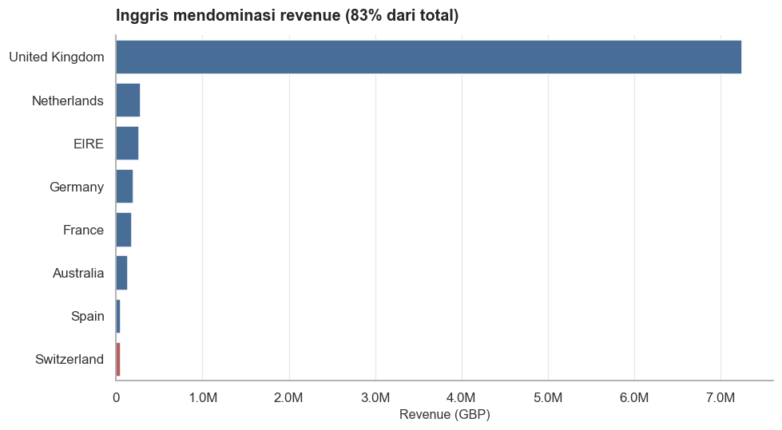

**Lonjakan akhir tahun (Q4) itu nyata, bukan kebetulan.** Uji **Mann-Whitney U**
memberi nilai-p ≈ `1.5e-13` (median revenue harian Q4 37.864 vs 21.956 di sisa
tahun). Artinya: musim ramai grosir menjelang Natal bisa diandalkan untuk
menjadwalkan kampanye dan stok jauh hari.

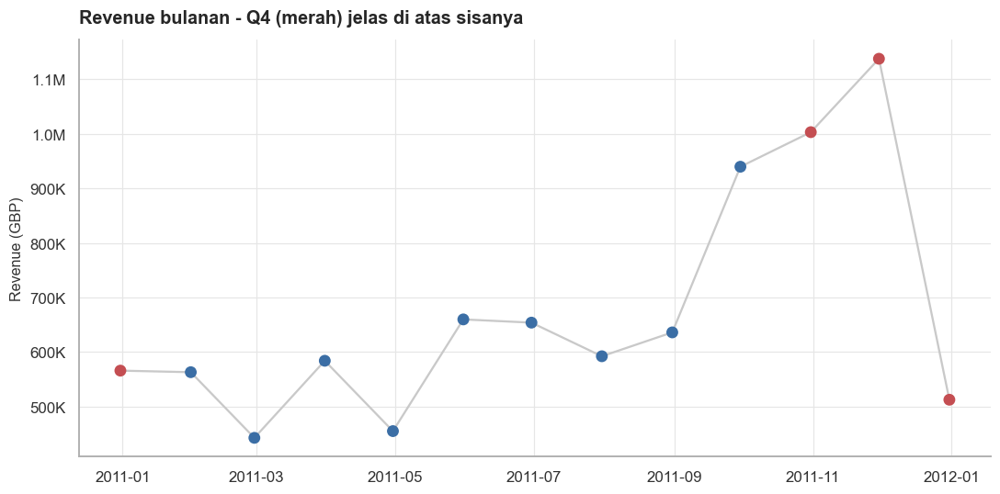

**Barang murah memang diborong lebih banyak.** Uji **Kruskal-Wallis** signifikan
(nilai-p ≈ 0); median kuantitas turun dari 12 unit (Budget) ke 2 unit (Premium).
Artinya: bisnis ini hidup dari volume barang terjangkau, bukan sedikit barang mahal.

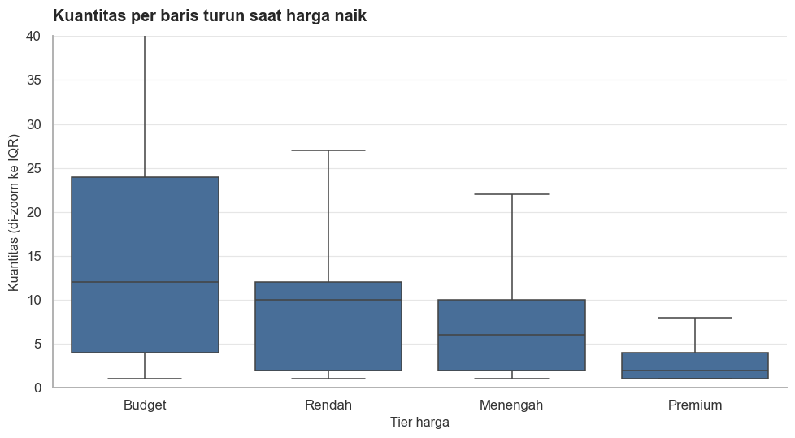

**Pemesanan memuncak tengah hari (11.00-14.00).** Konsisten dengan pembeli yang
memesan saat jam kerja. Artinya: kirim kampanye menjelang siang, bukan malam.

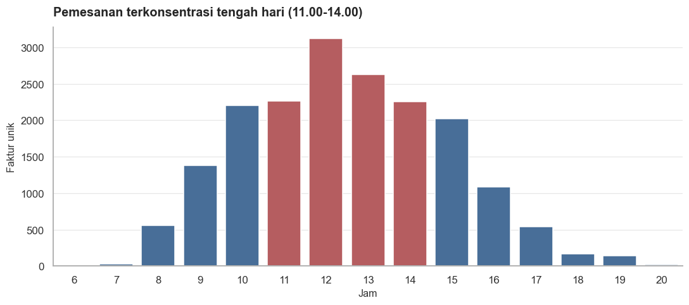

### 3.2 Feature Engineering & Preprocessing

Transaksi diringkas jadi satu baris per pelanggan dengan **8 fitur perilaku**:
Recency, Frequency, Monetary, AOV, Tenure, AvgBasketSize (per struk),
ProductDiversity, dan ReturnRate. Beberapa fitur sangat miring (segelintir akun
grosir belanja jauh di atas rata-rata), jadi ditangani dengan transformasi `log1p`
di dalam **pipeline bebas kebocoran** - bukan dengan membuang outlier, karena
merekalah pelanggan paling berharga.

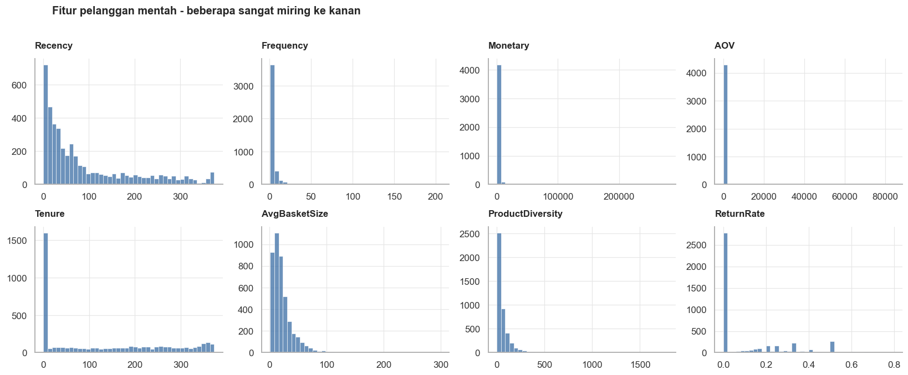

PCA dipakai untuk memastikan bahwa memodelkan di ruang fitur penuh sudah tepat
(hanya 8 fitur, mudah diinterpretasi). PCA/UMAP selanjutnya hanya untuk visualisasi.

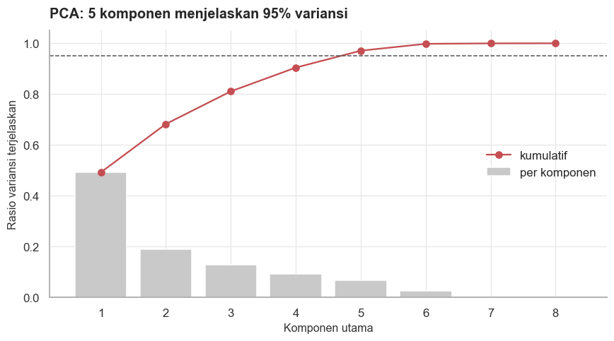

### 3.3 Modeling & Evaluation

**Empat algoritma diadu, bukan langsung pakai satu.** Jumlah cluster K-Means dipilih
menyeimbangkan dukungan statistik dan kegunaan bisnis (k = 4).

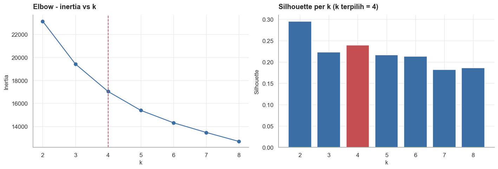

Hasil perbandingan pada tiga metrik validasi internal:

| Model | Jumlah cluster | Noise % | Silhouette ↑ | Davies-Bouldin ↓ | Calinski-Harabasz ↑ |
|---|---|---|---|---|---|
| **K-Means** | 4 | 0 | **0.239** | **1.369** | **1495** |
| GMM (via BIC) | 8 | 0 | 0.087 | 2.342 | 585 |
| DBSCAN | 2 | 98.6 | 0.819* | 0.238 | 654 |
| HDBSCAN | 3 | 77.4 | 0.262 | 1.030 | 256 |

*Arti temuannya:* silhouette DBSCAN terlihat tertinggi (0.819), **tapi itu palsu** -
ia membuang ~99% pelanggan sebagai noise dan hanya menyisakan segelintir titik.
HDBSCAN pun masih membuang 77% pelanggan. Di antara metode yang menugaskan **semua**
pelanggan, **K-Means menang telak** di setiap metrik dan memberi segmen yang paling
seimbang serta mudah dijelaskan.

**Model terbukti stabil.** Dijalankan ulang 10 kali dengan titik awal berbeda,
**Adjusted Rand Index = 0.992** (nyaris identik) - hasilnya bukan keberuntungan.
Plot silhouette juga menunjukkan mayoritas pelanggan duduk mantap di clusternya.

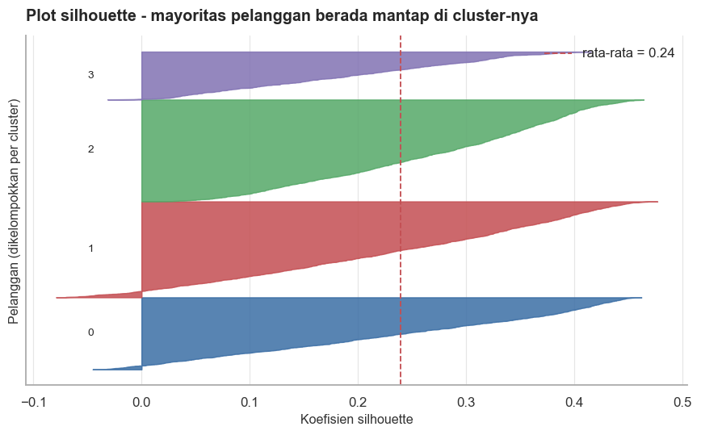

Proyeksi 2D (PCA & UMAP) mengonfirmasi keempat segmen memang terpisah secara visual.

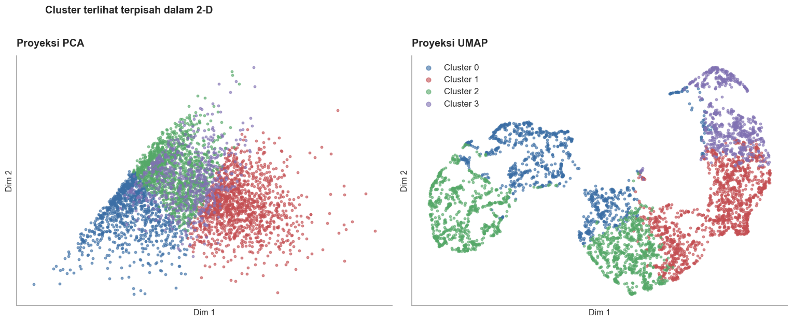

### 3.4 Segmen yang Ditemukan

Keempat cluster diterjemahkan jadi persona yang mudah dikenali (nama bersifat
relatif terhadap basis pelanggan toko ini):

| Segmen | Pelanggan | Recency (hari) | Frequency | Belanja (GBP) | Arti |
|---|---|---|---|---|---|
| **Juara** | 1.308 | 16 | 7 | 2.424 | Baru, sering, belanja besar - pelanggan terbaik |
| **Setia** | 1.389 | 70 | 2 | 505 | Konsisten, bernilai stabil |
| **Calon Setia** | 654 | 74 | 2 | 717 | Baru, keterlibatan menaik |
| **Berisiko** | 983 | 131 | 1 | 186 | Dulu aktif, kini mulai menghilang |

*Arti temuannya:* muncul ketimpangan khas retail - segmen **Juara** jumlahnya paling
sedikit tapi menyumbang porsi revenue terbesar, sementara segmen **Berisiko**
banyak jumlahnya tapi kecil sumbangannya. Justru ketimpangan inilah yang membuat
segmentasi berharga: ia menunjukkan di mana tiap rupiah pemasaran paling berbuah.

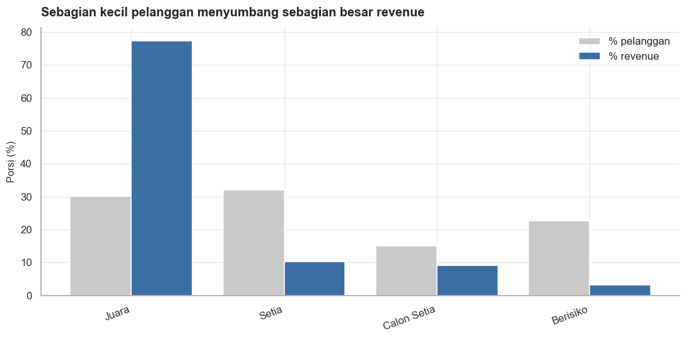

---

## 4. Kesimpulan & Rekomendasi

**Kesimpulan.** Dari setahun transaksi mentah, toko ini terbukti punya empat
kelompok pelanggan yang berbeda nyata dan stabil, dengan revenue menumpuk di
segelintir pelanggan bernilai tinggi. Pendekatan "semua diperlakukan sama" jelas
menyia-nyiakan peluang.

**Rekomendasi per segmen** (diurut berdasar revenue yang dipertaruhkan):

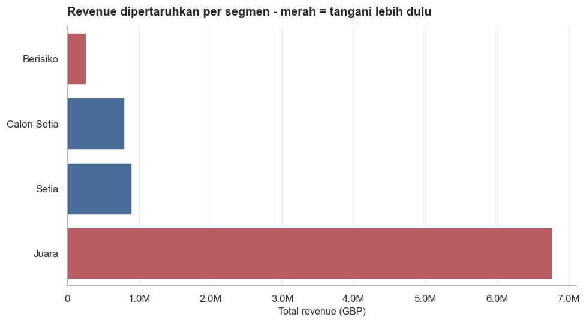

- **Juara** - hadiahi & pertahankan: perk VIP, akses awal, insentif referral.
  Jangan diberi diskon; mereka sudah loyal, jadi jaga margin.
- **Berisiko** - **prioritaskan lebih dulu**: kampanye reaktivasi pada kategori
  favorit mereka. Di sinilah revenue paling mungkin diselamatkan per kontak.
- **Calon Setia** - rawat menuju loyalitas: seri onboarding, insentif pembelian
  kedua, rekomendasi personal.
- **Setia** - perbesar belanja mereka: cross-sell tertarget dan tingkatan loyalitas.

**Saran pengembangan.** Pantau perpindahan pelanggan antar segmen dari waktu ke
waktu, uji A/B tiap rekomendasi untuk mengukur dampak nyatanya, dan tambahkan fitur
kedekatan produk untuk menajamkan penawaran cross-sell.

---

*Tech stack: Python · pandas · NumPy · scikit-learn · SciPy · UMAP · Matplotlib · Seaborn*
